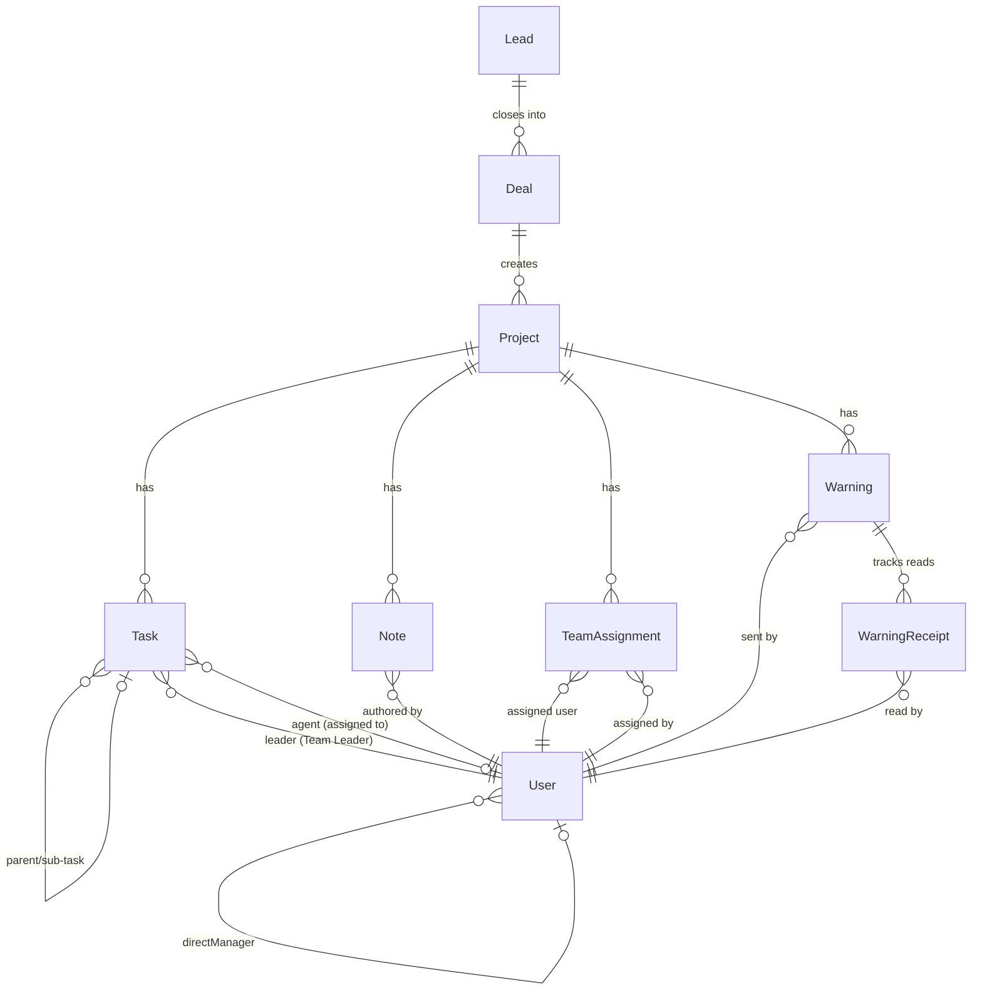

# Data Model: Operations & Task Distribution System

**Branch**: `002-operations-task-distribution` | **Date**: 2026-04-23

## Overview

This feature extends the **existing** Prisma schema. No new models are required — only column additions to `Task` and `Warning`.

## Existing Models (No Changes)

These models are fully functional and require zero modifications:

| Model | Purpose |
|-------|---------|
| `User` | All 24 roles, manager hierarchy, specializations |
| `Project` | Client project with lifecycle states (Onboarding/Active/On_Hold/Completed/Churned) |
| `Note` | Timestamped notes per project, categorized by department |
| `TeamAssignment` | Tracks which users are assigned to a project, by department |
| `WarningReceipt` | Relational acknowledgment tracking (replaces JSON field) |
| `Lead` | Pre-sales lead data (TeleSales/Sales journey) |
| `Deal` | Closed deal data linking Lead → Project |
| `CallLog` | TeleSales call history |
| `Meeting` | Sales meeting records |

## Modified Models

### Task (add 3 columns)

```
Model: Task (existing)
Added columns:
  - flagReason     String?    // Reason text when agent flags/returns task
  - flaggedAt      DateTime?  // Timestamp of flag action
  - flaggedByUserId String?   // User ID of agent who flagged

Existing columns (unchanged):
  - id, projectId, leaderId, agentId, taskType, checklistItems,
    progressPct, requesterRole, assignedRole, brief, deadline,
    priority, status, parentTaskId, files, startedAt, createdAt, completedAt
```

**State transitions**:
```
pending → in_progress → review → done
                ↓
           (flag) → pending (returned to Team Leader queue)
```

When an agent flags a task:
1. `status` reverts to `pending`
2. `agentId` is set to `null`
3. `flagReason`, `flaggedAt`, `flaggedByUserId` are populated
4. The task reappears in the Team Leader's unassigned queue

When a Team Leader reassigns:
1. `agentId` is set to the new agent
2. `status` remains `pending`
3. Flag fields are preserved for audit trail

### Warning (add 2 columns)

```
Model: Warning (existing)
Added columns:
  - resolvedAt       DateTime?  // Timestamp when creator marked as resolved
  - resolvedByUserId String?    // User ID of the resolver (must match senderUserId)

Existing columns (unchanged):
  - id, clientId, projectId, subject, message, severity,
    status, senderUserId, senderRole, recipientRoles,
    acknowledgedBy, createdAt
```

**State transitions**:
```
Active → Resolved    (only by Warning creator — senderUserId)
Active → Archived    (admin override)
```

## Entity Relationship Diagram



## Validation Rules

### Task Flag
- `flagReason` is required (non-empty) when flagging
- Only the `agentId` user can flag their own task
- Task must be in `in_progress` or `pending` status to be flagged
- Cannot flag a task that is already `done`

### Warning Resolution
- Only `senderUserId === resolvedByUserId` is allowed
- `status` must be `Active` to resolve
- `resolvedAt` is auto-set to current timestamp

### Client Reassignment (Project)
- Only `head_account_manager` or `super_admin` can reassign
- `accountManagerId` is updated to the new user
- All `TeamAssignment`, `Task`, `Note`, and `Warning` records remain linked to the `Project` (no data migration needed)
- A `ProjectLog` entry is created with action `reassigned`

### Distribution Permissions (existing, enforced)
```
head_account_manager → account_manager, head_technical
account_manager → head_seo
head_technical → team_leader_social_media, team_leader_media_buyer
head_seo → team_leader_seo
team_leader_seo → agent_seo, agent_content_seo
team_leader_social_media → agent_social_media
team_leader_media_buyer → agent_media_buyer
leader_graphic_designer → agent_graphic_designer
leader_motion_graphic → agent_motion_graphic
leader_ui → agent_ui
```

## Indexes

No new indexes needed — existing indexes on `Task(projectId)`, `Warning(projectId, senderUserId)`, `TeamAssignment(projectId, userId)`, `Note(projectId, userId)` cover all query patterns.
