# 🔄 Thamaraa CRM — Advanced Workflow (من الألف للياء)

> **هذا المستند يغطي كل خطوة في النظام من لحظة دخول العميل المحتمل (Lead) حتى تسليم المشروع النهائي والتحصيل المالي.**

---

## 📊 الخريطة العامة — رحلة العميل الكاملة

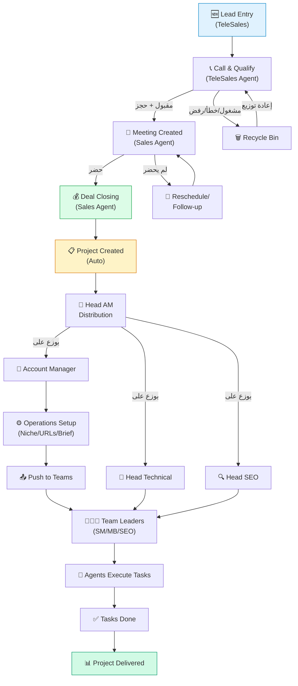
```mermaid
flowchart TD
    A["🆕 Lead Entry<br/>(TeleSales)"] --> B["📞 Call & Qualify<br/>(TeleSales Agent)"]
    B -->|"مقبول + حجز"| C["📅 Meeting Created<br/>(Sales Agent)"]
    B -->|"مشغول/خطأ/رفض"| R["🗑️ Recycle Bin"]
    R -->|"إعادة توزيع"| B
    C -->|"حضر"| D["💰 Deal Closing<br/>(Sales Agent)"]
    C -->|"لم يحضر"| C2["🔄 Reschedule/<br/>Follow-up"]
    C2 --> C
    D --> E["📋 Project Created<br/>(Auto)"]
    E --> F["👔 Head AM<br/>Distribution"]
    F -->|"يوزع على"| G["👤 Account Manager"]
    F -->|"يوزع على"| H["🔧 Head Technical"]
    F -->|"يوزع على"| I["🔍 Head SEO"]
    G --> J["⚙️ Operations Setup<br/>(Niche/URLs/Brief)"]
    J --> K["📤 Push to Teams"]
    K --> L["🧑‍🤝‍🧑 Team Leaders<br/>(SM/MB/SEO)"]
    L --> M["👥 Agents Execute Tasks"]
    M --> N["✅ Tasks Done"]
    N --> O["📊 Project Delivered"]
    H --> L
    I --> L
    
    style A fill:#e0f2fe,stroke:#0284c7
    style D fill:#dcfce7,stroke:#16a34a
    style E fill:#fef3c7,stroke:#d97706
    style O fill:#d1fae5,stroke:#059669
```

---

## 🏗️ المرحلة 1: اكتساب العملاء المحتملين (TeleSales)

### 1.1 — إدخال Lead جديد

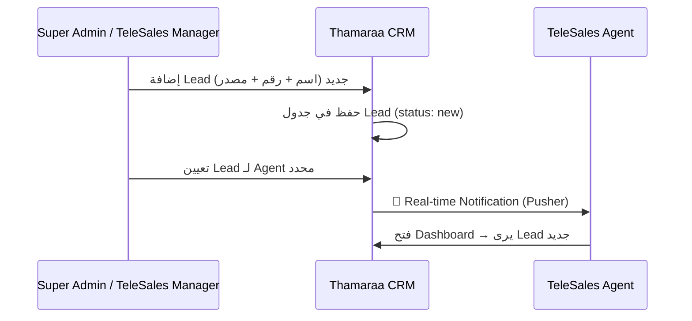
```mermaid
sequenceDiagram
    participant Admin as Super Admin / TeleSales Manager
    participant System as Thamaraa CRM
    participant Agent as TeleSales Agent
    
    Admin->>System: إضافة Lead جديد (اسم + رقم + مصدر)
    System->>System: حفظ في جدول Lead (status: new)
    Admin->>System: تعيين Lead لـ Agent محدد
    System->>Agent: 🔔 Real-time Notification (Pusher)
    Agent->>System: فتح Dashboard → يرى Lead جديد
```

> **الملفات المعنية:**
> - [TeleSalesClient.tsx](file:///C:/Users/Mohamed%20Adel/Desktop/Thamara/Thamaraaa/src/app/dashboard/telesales/TeleSalesClient.tsx) — الداشبورد الرئيسي
> - `/api/leads` — API إضافة وتعديل الـ Leads

### 1.2 — دورة الاتصال (Call Cycle)

| الخطوة | الإجراء | النتيجة في النظام |
|--------|---------|------------------|
| 1 | Agent يفتح Lead ويضغط "اتصال" | يُسجّل Call Log جديد |
| 2 | يختار نتيجة المكالمة | `callStatus` يتغير |
| 3 | يكتب ملاحظات | `notes` تُحفظ في CallLog |
| 4 | يصنّف العميل | `classification` يُحدّث |

**نتائج المكالمات الممكنة:**

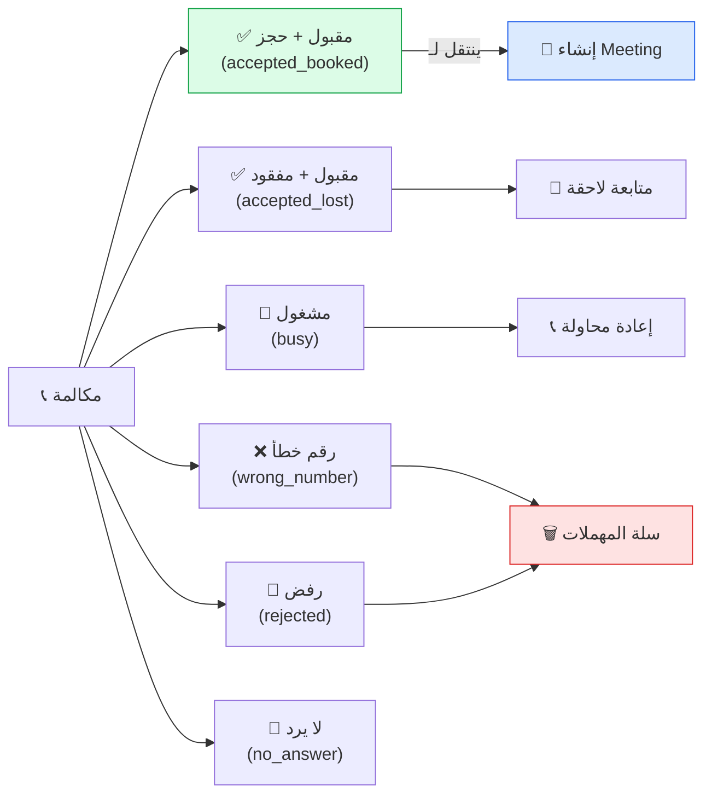
```mermaid
flowchart LR
    Call["📞 مكالمة"] --> A["✅ مقبول + حجز<br/>(accepted_booked)"]
    Call --> B["✅ مقبول + مفقود<br/>(accepted_lost)"]
    Call --> C["📵 مشغول<br/>(busy)"]
    Call --> D["❌ رقم خطأ<br/>(wrong_number)"]
    Call --> E["🚫 رفض<br/>(rejected)"]
    Call --> F["📴 لا يرد<br/>(no_answer)"]
    
    A -->|"ينتقل لـ"| Meeting["📅 إنشاء Meeting"]
    B --> Followup["🔄 متابعة لاحقة"]
    C --> Retry["📞 إعادة محاولة"]
    D --> Bin["🗑️ سلة المهملات"]
    E --> Bin
    
    style A fill:#dcfce7,stroke:#16a34a
    style Meeting fill:#dbeafe,stroke:#2563eb
    style Bin fill:#fee2e2,stroke:#dc2626
```

### 1.3 — الأعمدة المخصصة (Custom Columns)

| الوظيفة | الوصف |
|---------|-------|
| إضافة عمود | المدير يضيف عمود جديد (اسم + icon اختياري) |
| تعبئة البيانات | Agent يملأ القيمة لكل Lead |
| الظهور في الجدول | العمود يظهر بجانب الأعمدة الأساسية |
| الحذف | المدير فقط يقدر يحذف العمود |

### 1.4 — بطاقات KPI (مرشحات تفاعلية)

| البطاقة | الوظيفة عند الضغط |
|---------|-------------------|
| Total Leads | يعرض كل الـ Leads |
| مقبول + حجز | يفلتر فقط الناجحين مع حجز |
| مقبول + مفقود | يفلتر الناجحين بدون حجز |
| مشغول | يفلتر المشغولين |
| رقم خطأ | يفلتر الأرقام الخاطئة |

### 1.5 — Cold Leads

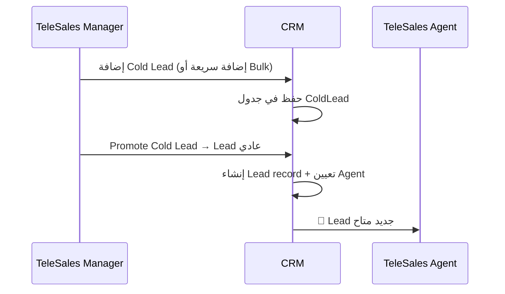
```mermaid
sequenceDiagram
    participant Manager as TeleSales Manager
    participant System as CRM
    participant Agent as TeleSales Agent
    
    Manager->>System: إضافة Cold Lead (إضافة سريعة أو Bulk)
    System->>System: حفظ في جدول ColdLead
    Manager->>System: Promote Cold Lead → Lead عادي
    System->>System: إنشاء Lead record + تعيين Agent
    System->>Agent: 🔔 Lead جديد متاح
```

### 1.6 — سلة المهملات (Recycle Bin)

| الإجراء | التفاصيل |
|---------|----------|
| الحذف | Lead مع classification سلبي يُنقل للسلة |
| العرض | المدير يشوف كل Leads المحذوفة |
| إعادة التوزيع | المدير يقدر يعيد Lead لأي Agent |
| الحذف النهائي | غير متاح (للحماية) |

---

## 📅 المرحلة 2: المبيعات (Sales)

### 2.1 — استقبال الاجتماعات

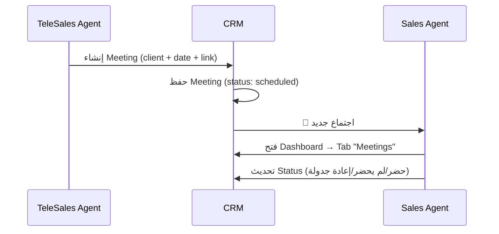
```mermaid
sequenceDiagram
    participant TeleSales as TeleSales Agent
    participant System as CRM
    participant Sales as Sales Agent
    
    TeleSales->>System: إنشاء Meeting (client + date + link)
    System->>System: حفظ Meeting (status: scheduled)
    System->>Sales: 🔔 اجتماع جديد
    Sales->>System: فتح Dashboard → Tab "Meetings"
    Sales->>System: تحديث Status (حضر/لم يحضر/إعادة جدولة)
```

### 2.2 — نظام الحالة الذكي (Status Toggle)

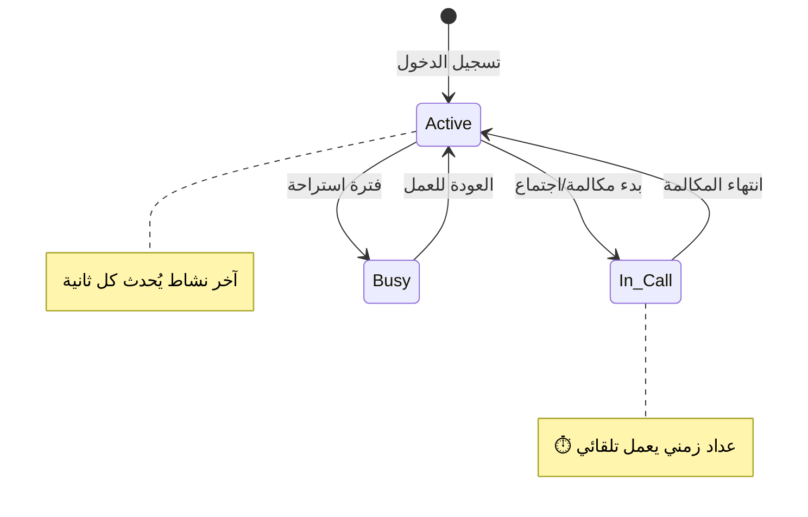
```mermaid
stateDiagram-v2
    [*] --> Active: تسجيل الدخول
    Active --> In_Call: بدء مكالمة/اجتماع
    In_Call --> Active: انتهاء المكالمة
    Active --> Busy: فترة استراحة
    Busy --> Active: العودة للعمل
    
    note right of In_Call: ⏱️ عداد زمني يعمل تلقائي
    note right of Active: آخر نشاط يُحدث كل ثانية
```

### 2.3 — إقفال الصفقة (Deal Closing)

> **هذا هو أهم مرحلة — يتحول العميل من "Lead" إلى "Client حقيقي"**

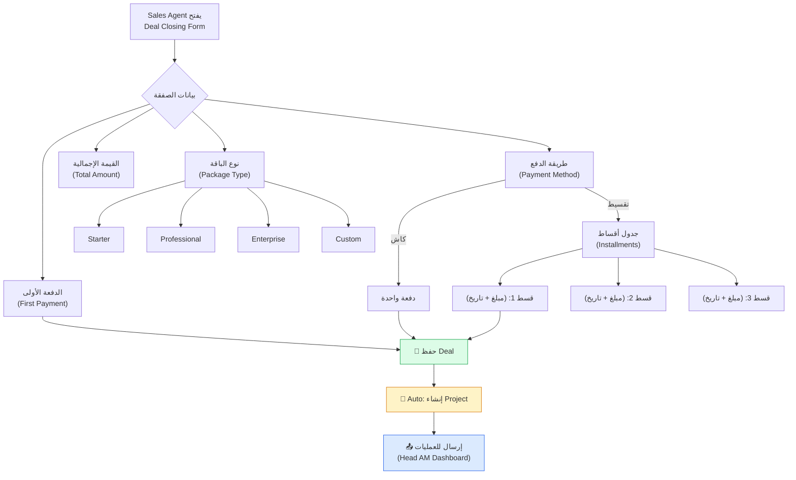
```mermaid
flowchart TD
    A["Sales Agent يفتح<br/>Deal Closing Form"] --> B{"بيانات الصفقة"}
    B --> C["نوع الباقة<br/>(Package Type)"]
    B --> D["القيمة الإجمالية<br/>(Total Amount)"]
    B --> E["طريقة الدفع<br/>(Payment Method)"]
    B --> F["الدفعة الأولى<br/>(First Payment)"]
    
    E -->|"تقسيط"| G["جدول أقساط<br/>(Installments)"]
    E -->|"كاش"| H["دفعة واحدة"]
    
    C --> PKG1["Starter"]
    C --> PKG2["Professional"]
    C --> PKG3["Enterprise"]
    C --> PKG4["Custom"]
    
    G --> I["قسط 1: (مبلغ + تاريخ)"]
    G --> J["قسط 2: (مبلغ + تاريخ)"]
    G --> K["قسط 3: (مبلغ + تاريخ)"]
    
    F --> L["💾 حفظ Deal"]
    H --> L
    I --> L
    
    L --> M["🔄 Auto: إنشاء Project"]
    M --> N["📤 إرسال للعمليات<br/>(Head AM Dashboard)"]
    
    style L fill:#dcfce7,stroke:#16a34a
    style M fill:#fef3c7,stroke:#d97706
    style N fill:#dbeafe,stroke:#2563eb
```

**بيانات الصفقة المحفوظة:**

| الحقل | النوع | الوصف |
|-------|-------|-------|
| `package` | enum | نوع الباقة |
| `totalAmount` | float | القيمة الإجمالية |
| `paymentMethod` | string | كاش / تقسيط / تحويل |
| `firstAmount` | float | الدفعة الأولى |
| `installment1Amount` | float | قيمة القسط الأول |
| `installment1Date` | date | تاريخ القسط الأول |
| `installment2Amount` | float | قيمة القسط الثاني |
| `installment2Date` | date | تاريخ القسط الثاني |
| `installment3Amount` | float | قيمة القسط الثالث |
| `installment3Date` | date | تاريخ القسط الثالث |

### 2.4 — Feedback Form

بعد كل اجتماع، الـ Sales Agent يملأ:

| الحقل | الوصف |
|-------|-------|
| Client Profile | نوع العميل + مستوى الجدية |
| Classification | تصنيف (Hot/Warm/Cold) |
| Store Type | نوع المتجر (إلكتروني/خدمي/منتجات) |
| Notes | ملاحظات تفصيلية عن الاجتماع |

### 2.5 — التفعيل الآلي (Auto Activation)

```
✅ Deal Saved → 🔄 System Creates Project → 📋 Project appears in Head AM Dashboard
```

> **ملف تنفيذي:** [SalesClient.tsx](file:///C:/Users/Mohamed%20Adel/Desktop/Thamara/Thamaraaa/src/app/dashboard/sales/SalesClient.tsx)

---

## 📋 المرحلة 3: إدارة الحسابات (Account Management)

### 3.1 — Head Account Manager — مركز التوزيع

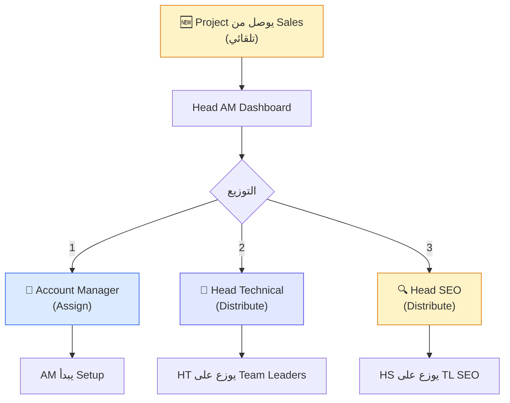
```mermaid
flowchart TD
    A["🆕 Project يوصل من Sales<br/>(تلقائي)"] --> B["Head AM Dashboard"]
    B --> C{"التوزيع"}
    C -->|"1"| D["👤 Account Manager<br/>(Assign)"]
    C -->|"2"| E["🔧 Head Technical<br/>(Distribute)"]
    C -->|"3"| F["🔍 Head SEO<br/>(Distribute)"]
    
    D --> G["AM يبدأ Setup"]
    E --> H["HT يوزع على Team Leaders"]
    F --> I["HS يوزع على TL SEO"]
    
    style A fill:#fef3c7,stroke:#d97706
    style D fill:#dbeafe,stroke:#2563eb
    style E fill:#e0e7ff,stroke:#4f46e5
    style F fill:#fef3c7,stroke:#d97706
```

**أزرار Head AM:**

| الزر | الإجراء | API |
|------|---------|-----|
| Assign to AM | يعيّن Account Manager | `/api/projects/[id]/assign-account-manager` |
| Distribute to HT | يوزع لـ Head Technical | `/api/projects/[id]/assign-head-technical` |
| Distribute to HSEO | يوزع لـ Head SEO | `/api/projects/[id]/assign-head-seo` |

> **ملف تنفيذي:** [HeadAccountManagerClient.tsx](file:///C:/Users/Mohamed%20Adel/Desktop/Thamara/Thamaraaa/src/app/dashboard/head-account-manager/HeadAccountManagerClient.tsx)

### 3.2 — Account Manager — العمليات والإعداد

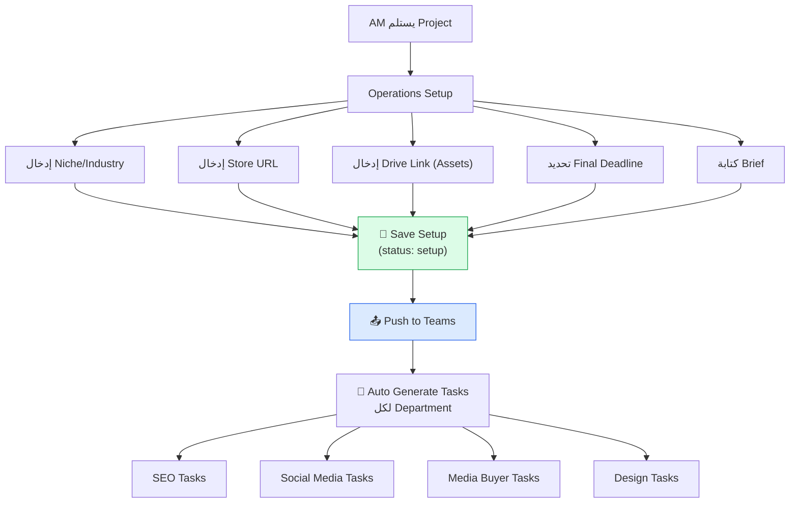
```mermaid
flowchart TD
    A["AM يستلم Project"] --> B["Operations Setup"]
    B --> C["إدخال Niche/Industry"]
    B --> D["إدخال Store URL"]
    B --> E["إدخال Drive Link (Assets)"]
    B --> F["تحديد Final Deadline"]
    B --> G["كتابة Brief"]
    
    C & D & E & F & G --> H["💾 Save Setup<br/>(status: setup)"]
    H --> I["📤 Push to Teams"]
    I --> J["🔄 Auto Generate Tasks<br/>لكل Department"]
    
    J --> K["SEO Tasks"]
    J --> L["Social Media Tasks"]
    J --> M["Media Buyer Tasks"]
    J --> N["Design Tasks"]
    
    style H fill:#dcfce7,stroke:#16a34a
    style I fill:#dbeafe,stroke:#2563eb
```

**نظام حالات المشروع:**

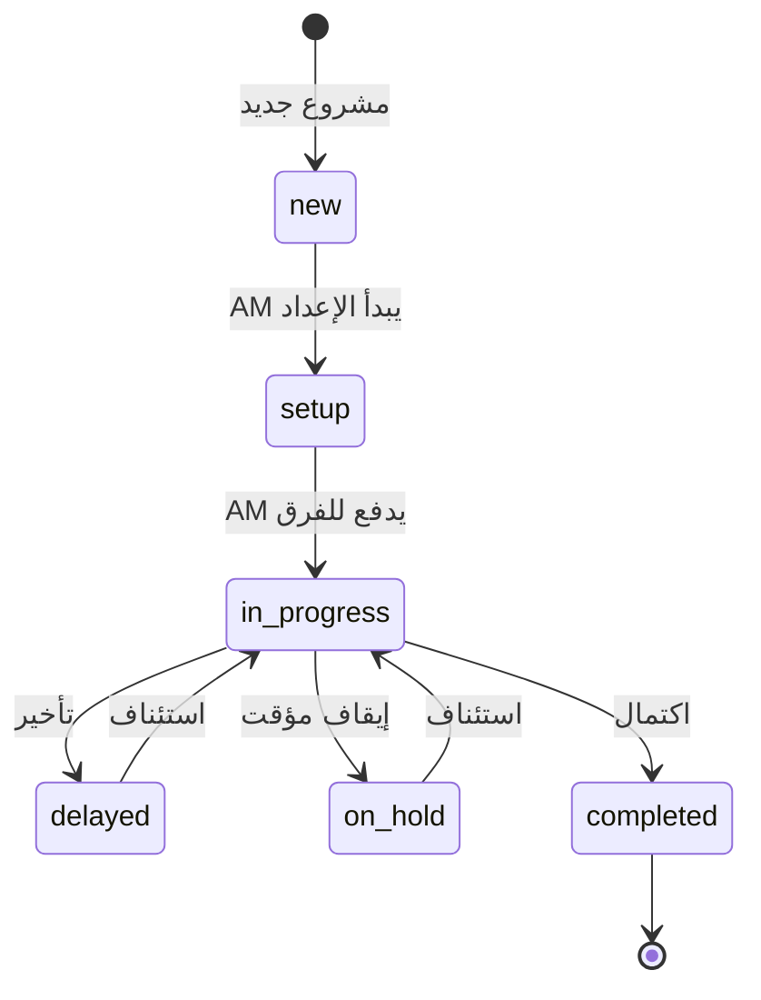
```mermaid
stateDiagram-v2
    [*] --> new: مشروع جديد
    new --> setup: AM يبدأ الإعداد
    setup --> in_progress: AM يدفع للفرق
    in_progress --> delayed: تأخير
    in_progress --> on_hold: إيقاف مؤقت
    in_progress --> completed: اكتمال
    delayed --> in_progress: استئناف
    on_hold --> in_progress: استئناف
    completed --> [*]
```

### 3.3 — AM Lifecycle Management

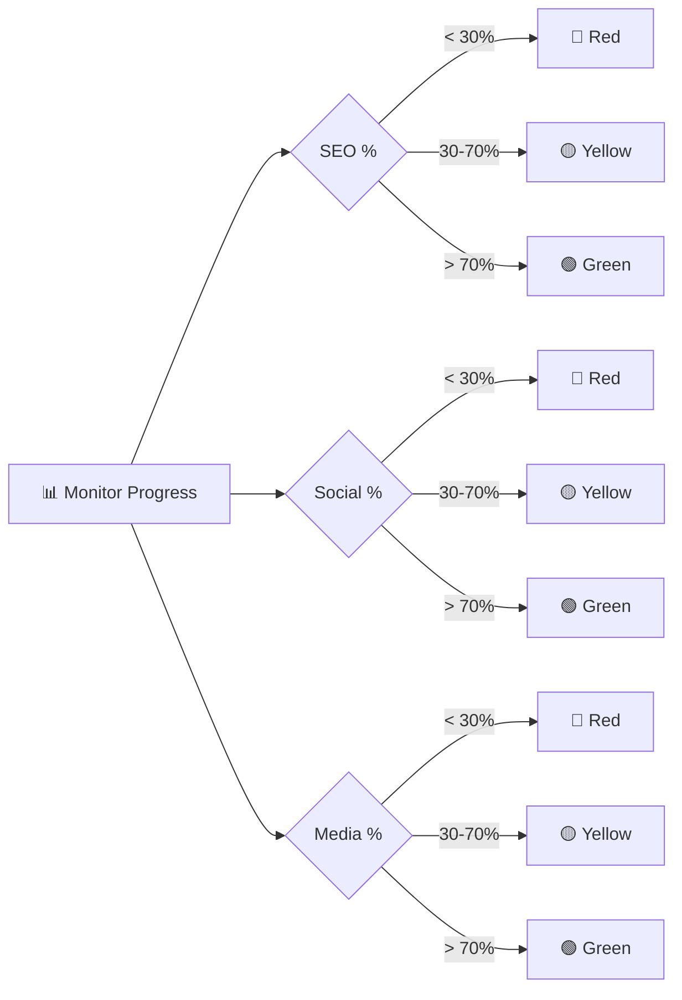
```mermaid
flowchart LR
    A["📊 Monitor Progress"] --> B{"SEO %"}
    A --> C{"Social %"}
    A --> D{"Media %"}
    
    B -->|"< 30%"| RED1["🔴 Red"]
    B -->|"30-70%"| YEL1["🟡 Yellow"]
    B -->|"> 70%"| GRN1["🟢 Green"]
    
    C -->|"< 30%"| RED2["🔴 Red"]
    C -->|"30-70%"| YEL2["🟡 Yellow"]
    C -->|"> 70%"| GRN2["🟢 Green"]
    
    D -->|"< 30%"| RED3["🔴 Red"]
    D -->|"30-70%"| YEL3["🟡 Yellow"]
    D -->|"> 70%"| GRN3["🟢 Green"]
```

> **ملف تنفيذي:** [AccountManagerClient.tsx](file:///C:/Users/Mohamed%20Adel/Desktop/Thamara/Thamaraaa/src/app/dashboard/account-manager/AccountManagerClient.tsx) + [OperationsClient.tsx](file:///C:/Users/Mohamed%20Adel/Desktop/Thamara/Thamaraaa/src/app/dashboard/operations/OperationsClient.tsx)

---

## 🔧 المرحلة 4: التوزيع التقني (Technical Distribution)

### 4.1 — Head Technical → Team Leaders

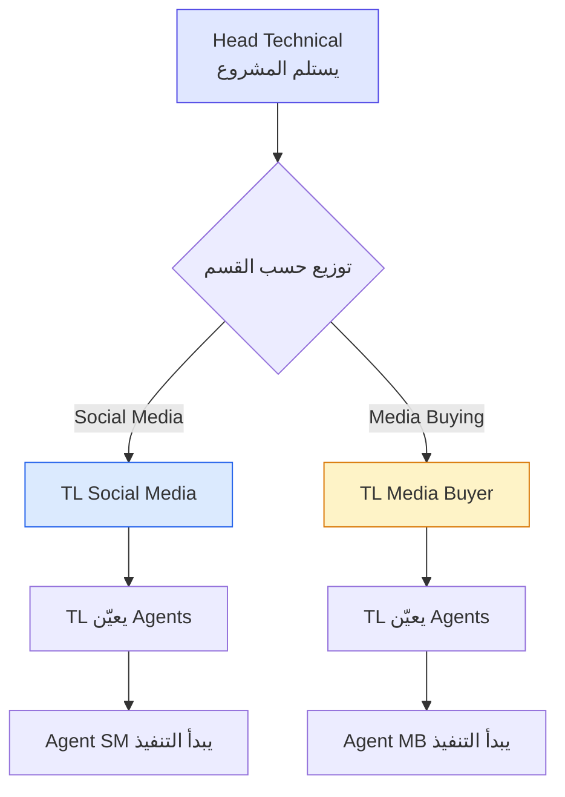
```mermaid
flowchart TD
    A["Head Technical<br/>يستلم المشروع"] --> B{"توزيع حسب القسم"}
    B -->|"Social Media"| C["TL Social Media"]
    B -->|"Media Buying"| D["TL Media Buyer"]
    
    C --> E["TL يعيّن Agents"]
    D --> F["TL يعيّن Agents"]
    
    E --> G["Agent SM يبدأ التنفيذ"]
    F --> H["Agent MB يبدأ التنفيذ"]
    
    style A fill:#e0e7ff,stroke:#4f46e5
    style C fill:#dbeafe,stroke:#2563eb
    style D fill:#fef3c7,stroke:#d97706
```

> **ملف تنفيذي:** [HeadTechnicalClient.tsx](file:///C:/Users/Mohamed%20Adel/Desktop/Thamara/Thamaraaa/src/app/dashboard/head-technical/HeadTechnicalClient.tsx)

### 4.2 — Head SEO → TL SEO → Agents

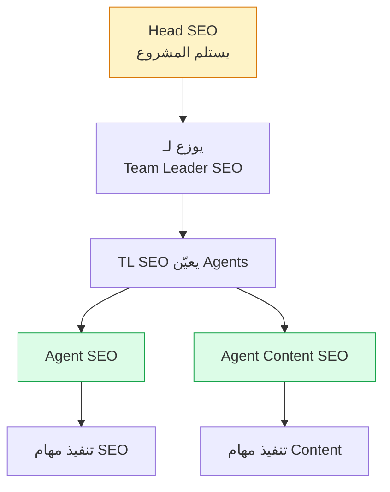
```mermaid
flowchart TD
    A["Head SEO<br/>يستلم المشروع"] --> B["يوزع لـ<br/>Team Leader SEO"]
    B --> C["TL SEO يعيّن Agents"]
    C --> D["Agent SEO"]
    C --> E["Agent Content SEO"]
    
    D --> F["تنفيذ مهام SEO"]
    E --> G["تنفيذ مهام Content"]
    
    style A fill:#fef3c7,stroke:#d97706
    style D fill:#dcfce7,stroke:#16a34a
    style E fill:#dcfce7,stroke:#16a34a
```

> **ملف تنفيذي:** [SeoClient.tsx](file:///C:/Users/Mohamed%20Adel/Desktop/Thamara/Thamaraaa/src/app/dashboard/seo/SeoClient.tsx)

---

## 👥 المرحلة 5: تنفيذ المهام (Team Execution)

### 5.1 — Social Media Workflow

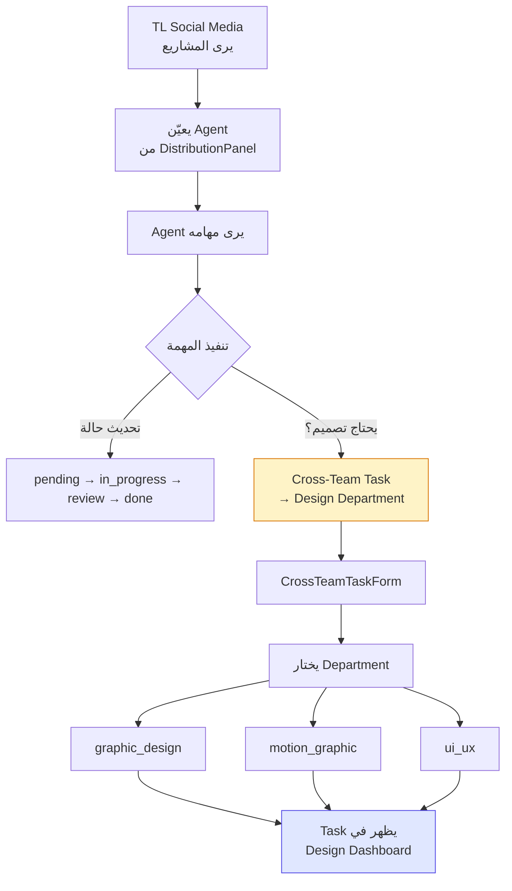
```mermaid
flowchart TD
    A["TL Social Media<br/>يرى المشاريع"] --> B["يعيّن Agent<br/>من DistributionPanel"]
    B --> C["Agent يرى مهامه"]
    C --> D{"تنفيذ المهمة"}
    D -->|"تحديث حالة"| E["pending → in_progress → review → done"]
    D -->|"يحتاج تصميم؟"| F["Cross-Team Task<br/>→ Design Department"]
    
    F --> G["CrossTeamTaskForm"]
    G --> H["يختار Department"]
    H --> I["graphic_design"]
    H --> J["motion_graphic"]
    H --> K["ui_ux"]
    
    I & J & K --> L["Task يظهر في<br/>Design Dashboard"]
    
    style F fill:#fef3c7,stroke:#d97706
    style L fill:#e0e7ff,stroke:#4f46e5
```

> **ملف تنفيذي:** [SocialMediaClient.tsx](file:///C:/Users/Mohamed%20Adel/Desktop/Thamara/Thamaraaa/src/app/dashboard/social-media/SocialMediaClient.tsx)

### 5.2 — Media Buyer Workflow

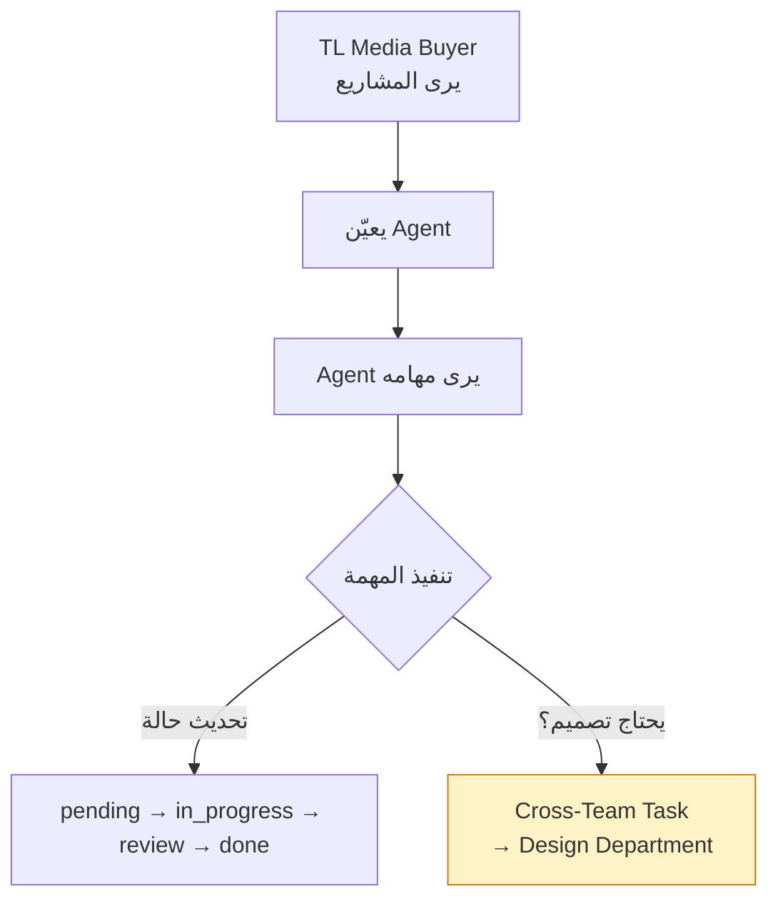
```mermaid
flowchart TD
    A["TL Media Buyer<br/>يرى المشاريع"] --> B["يعيّن Agent"]
    B --> C["Agent يرى مهامه"]
    C --> D{"تنفيذ المهمة"}
    D -->|"تحديث حالة"| E["pending → in_progress → review → done"]
    D -->|"يحتاج تصميم؟"| F["Cross-Team Task<br/>→ Design Department"]
    
    style F fill:#fef3c7,stroke:#d97706
```

> **ملف تنفيذي:** [MediaBuyerClient.tsx](file:///C:/Users/Mohamed%20Adel/Desktop/Thamara/Thamaraaa/src/app/dashboard/media-buyer/MediaBuyerClient.tsx)

### 5.3 — Design Department Workflow (الأهم)

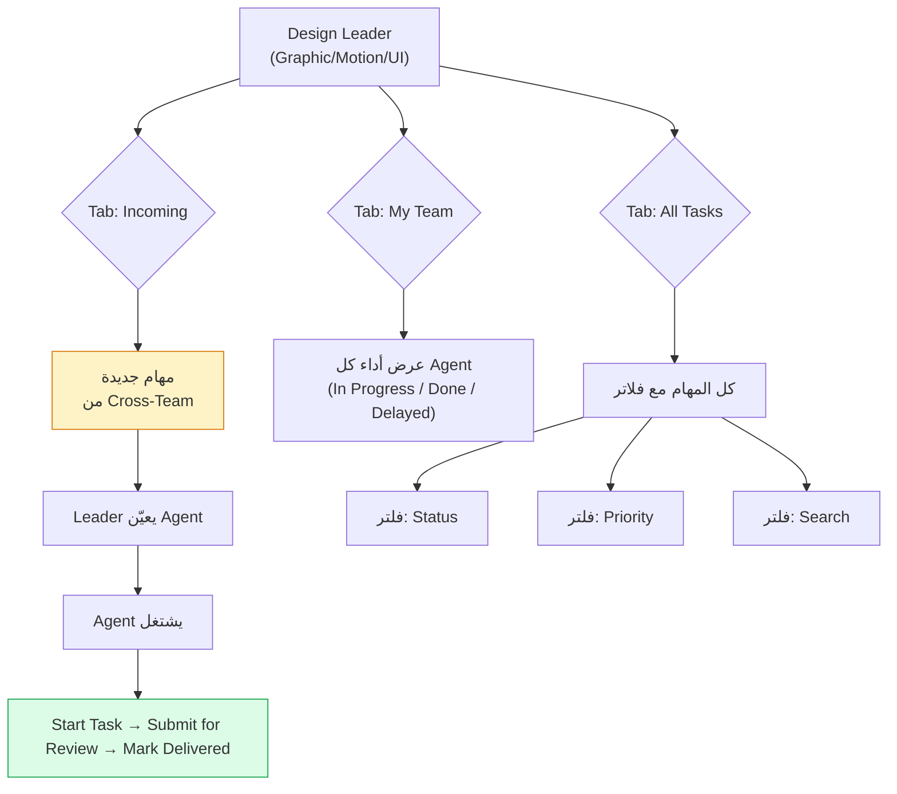
```mermaid
flowchart TD
    A["Design Leader<br/>(Graphic/Motion/UI)"] --> B{"Tab: Incoming"}
    B --> C["مهام جديدة<br/>من Cross-Team"]
    C --> D["Leader يعيّن Agent"]
    
    A --> E{"Tab: My Team"}
    E --> F["عرض أداء كل Agent<br/>(In Progress / Done / Delayed)"]
    
    A --> G{"Tab: All Tasks"}
    G --> H["كل المهام مع فلاتر"]
    H --> I["فلتر: Status"]
    H --> J["فلتر: Priority"]
    H --> K["فلتر: Search"]
    
    D --> L["Agent يشتغل"]
    L --> M["Start Task → Submit for Review → Mark Delivered"]
    
    style C fill:#fef3c7,stroke:#d97706
    style M fill:#dcfce7,stroke:#16a34a
```

**حالات المهمة في التصميم:**

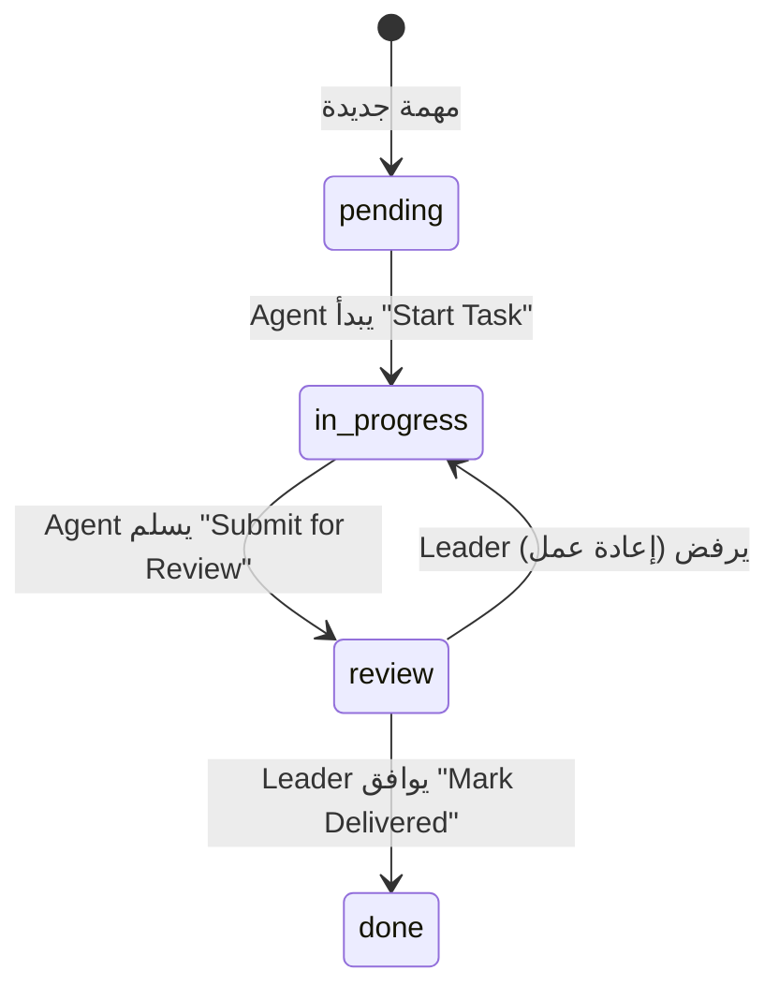
```mermaid
stateDiagram-v2
    [*] --> pending: مهمة جديدة
    pending --> in_progress: Agent يبدأ "Start Task"
    in_progress --> review: Agent يسلم "Submit for Review"
    review --> done: Leader يوافق "Mark Delivered"
    review --> in_progress: Leader يرفض (إعادة عمل)
```

> **ملف تنفيذي:** [DesignClient.tsx](file:///C:/Users/Mohamed%20Adel/Desktop/Thamara/Thamaraaa/src/app/dashboard/design/DesignClient.tsx)

---

## 🚨 المرحلة 6: نظام التحذيرات (Warning System)

### 6.1 — الـ Flow الكامل

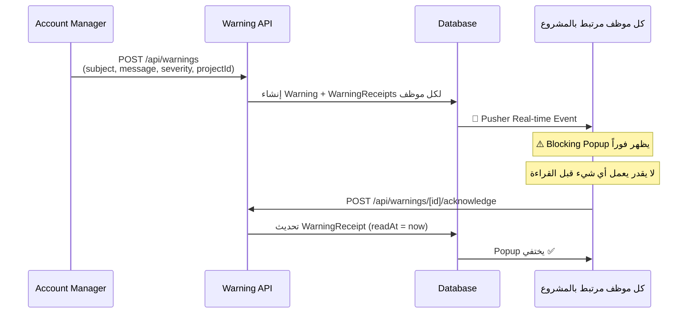
```mermaid
sequenceDiagram
    participant AM as Account Manager
    participant API as Warning API
    participant System as Database
    participant Target as كل موظف مرتبط بالمشروع
    
    AM->>API: POST /api/warnings<br/>(subject, message, severity, projectId)
    API->>System: إنشاء Warning + WarningReceipts لكل موظف
    System->>Target: 🔔 Pusher Real-time Event
    
    Note over Target: ⚠️ Blocking Popup يظهر فوراً
    Note over Target: لا يقدر يعمل أي شيء قبل القراءة
    
    Target->>API: POST /api/warnings/[id]/acknowledge
    API->>System: تحديث WarningReceipt (readAt = now)
    System->>Target: Popup يختفي ✅
```

### 6.2 — مستويات الخطورة

| المستوى | اللون | السلوك |
|---------|-------|--------|
| **High** | 🔴 أحمر | Blocking + "This action is logged" |
| **Medium** | 🟡 أصفر | Blocking + تأكيد |
| **Low** | 🔵 أزرق | Blocking + تأكيد بسيط |

### 6.3 — WarningPopup Component

```
✅ يمنع Scroll (document.body.style.overflow = "hidden")
✅ يمنع Escape (keydown preventDefault)
✅ z-index: 9999 (فوق كل شيء)
✅ يعرض Warning واحد في كل مرة
✅ "1 of N" — يعرض العدد
✅ زر "I have read and understood" — إجباري
```

> **ملف تنفيذي:** [WarningPopup.tsx](file:///C:/Users/Mohamed%20Adel/Desktop/Thamara/Thamaraaa/src/components/WarningPopup.tsx)

---

## 📝 المرحلة 7: نظام الملاحظات (Notes System)

### 7.1 — كيف تعمل الملاحظات

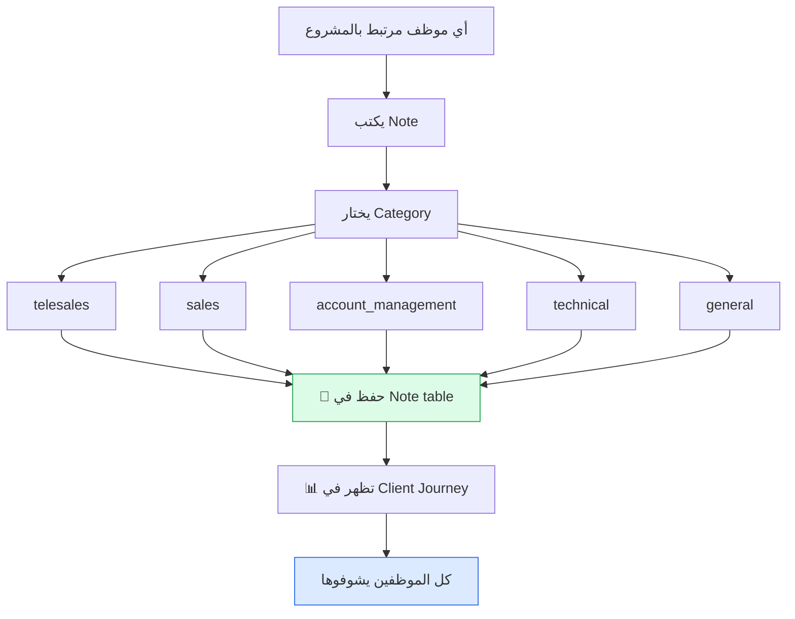
```mermaid
flowchart TD
    A["أي موظف مرتبط بالمشروع"] --> B["يكتب Note"]
    B --> C["يختار Category"]
    C --> D["telesales"]
    C --> E["sales"]
    C --> F["account_management"]
    C --> G["technical"]
    C --> H["general"]
    
    D & E & F & G & H --> I["💾 حفظ في Note table"]
    I --> J["📊 تظهر في Client Journey"]
    J --> K["كل الموظفين يشوفوها"]
    
    style I fill:#dcfce7,stroke:#16a34a
    style K fill:#dbeafe,stroke:#2563eb
```

---

## 🔄 المرحلة 8: رحلة العميل (Client Journey Timeline)

### 8.1 — مكونات الـ Timeline

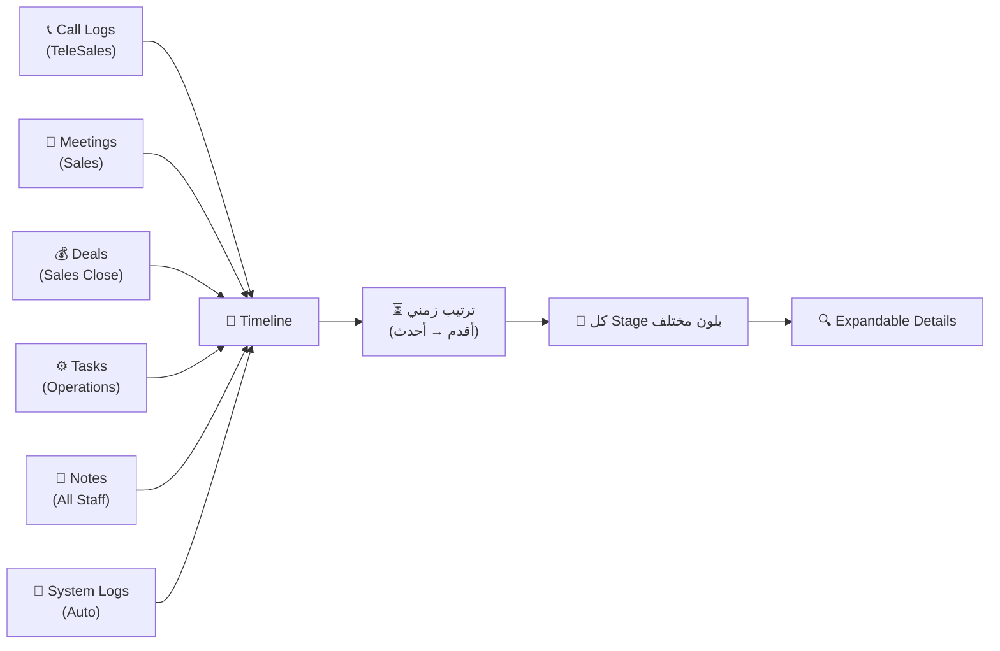
```mermaid
flowchart LR
    A["📞 Call Logs<br/>(TeleSales)"] --> TL["🔄 Timeline"]
    B["📅 Meetings<br/>(Sales)"] --> TL
    C["💰 Deals<br/>(Sales Close)"] --> TL
    D["⚙️ Tasks<br/>(Operations)"] --> TL
    E["📝 Notes<br/>(All Staff)"] --> TL
    F["🔄 System Logs<br/>(Auto)"] --> TL
    
    TL --> G["⏳ ترتيب زمني<br/>(أقدم → أحدث)"]
    G --> H["🎨 كل Stage بلون مختلف"]
    H --> I["🔍 Expandable Details"]
```

**ألوان الـ stages:**

| Stage | اللون | Icon |
|-------|-------|------|
| telesales | 🔵 أزرق | Clock |
| sales | 🟣 بنفسجي | CheckCircle |
| deal | 🟢 أخضر | FileText |
| accounts | 🟡 أصفر | CheckCircle |
| technical | 🔵 نيلي | CheckCircle |
| note | 🔵 فاتح | MessageSquare |
| system_log | ⚫ رمادي | GitCommit |
| warning_issued | 🔴 أحمر | AlertTriangle |
| task_created | 🟢 أخضر | PlusCircle |
| lifecycle_changed | 🟡 أصفر | RefreshCw |

> **ملف تنفيذي:** [ClientJourney.tsx](file:///C:/Users/Mohamed%20Adel/Desktop/Thamara/Thamaraaa/src/components/ClientJourney.tsx)

---

## 💰 المرحلة 9: المالية (Finance)

### 9.1 — Dashboard Overview

```mermaid
flowchart TD
    A["Finance Dashboard"] --> B["Tab: All Deals"]
    A --> C["Tab: Pending Installments"]
    
    B --> D["جدول كل الصفقات"]
    D --> E["Client Name + Agent"]
    D --> F["Total Value (SAR)"]
    D --> G["Collected Amount"]
    D --> H["Status: Fully Paid / Partial"]
    
    C --> I["بطاقات الأقساط"]
    I --> J["Installment # + Due Date"]
    I --> K["Amount (SAR)"]
    I --> L["Status: Pending / Overdue"]
    I --> M["✅ Mark as Paid"]
    
    style M fill:#dcfce7,stroke:#16a34a
```

**KPI Cards (تفاعلية):**

| البطاقة | القيمة | الفلتر عند الضغط |
|---------|--------|------------------|
| Total Revenue | مجموع كل الصفقات | all |
| Total Collected | المبلغ المحصّل | fully_paid |
| Total Remaining | المتبقي | partial |
| Upcoming Installments | أقساط قادمة | overdue (installments tab) |

> **ملف تنفيذي:** [FinanceClient.tsx](file:///C:/Users/Mohamed%20Adel/Desktop/Thamara/Thamaraaa/src/app/dashboard/finance/FinanceClient.tsx)

---

## 📊 المرحلة 10: القيادة (Chief Sales)

### 10.1 — Leaderboard Dashboard

```mermaid
flowchart TD
    A["Chief Sales Dashboard"] --> B["🕐 Range Selector<br/>(Today/Week/Month/All)"]
    B --> C["KPI Cards"]
    
    C --> D["💰 Total Revenue<br/>+ Target"]
    C --> E["✅ Collected Payments"]
    C --> F["📈 Conversion Rate<br/>(Deals/Leads %)"]
    C --> G["📅 Meetings Booked<br/>+ Attend %"]
    
    A --> H["📊 Leaderboards"]
    H --> I["Sales Team Rankings<br/>(Agent → Deals → Revenue)"]
    H --> J["TeleSales Rankings<br/>(Agent → Booked → Attended)"]
    
    A --> K["🚨 System Warnings"]
    K --> L["كل Warnings مع Severity"]
    
    D & E & F & G -->|"Click"| M["🔍 DrillDown Modal<br/>بيانات تفصيلية"]
    
    style M fill:#fef3c7,stroke:#d97706
```

> **ملف تنفيذي:** [ChiefSalesClient.tsx](file:///C:/Users/Mohamed%20Adel/Desktop/Thamara/Thamaraaa/src/app/dashboard/chief-sales/ChiefSalesClient.tsx)

---

## 👥 المرحلة 11: الموارد البشرية (HR)

### 11.1 — HR Manager Dashboard

```mermaid
flowchart TD
    A["HR Dashboard"] --> B["Tab: Attendance"]
    A --> C["Tab: Employees"]
    A --> D["Tab: Departments"]
    
    B --> E["Check In / Check Out"]
    B --> F["جدول الحضور بالتواريخ"]
    B --> G["Late Minutes tracking"]
    
    C --> H["إضافة موظف جديد"]
    C --> I["تعديل بيانات موظف"]
    C --> J["تفعيل / إلغاء تفعيل"]
    C --> K["بحث + فلتر بالقسم"]
    
    D --> L["عدد موظفين لكل قسم"]
    D --> M["Active vs Total"]
    D --> N["تفصيل كل Role"]
    
    style H fill:#dcfce7,stroke:#16a34a
```

**إضافة موظف:**

| الحقل | مطلوب | الوصف |
|-------|-------|-------|
| Full Name | ✅ | اسم الموظف |
| Email | ✅ | البريد الإلكتروني (فريد) |
| Password | ✅ | 6 أحرف على الأقل |
| Role | ✅ | من 25 دور متاح |
| Phone | ❌ | اختياري |

**الأدوار المتاحة (25 دور):**

| القسم | الأدوار |
|-------|---------|
| Administration | Super Admin |
| Sales | Chief Sales, Sales Manager, Sales Agent |
| TeleSales | TeleSales Manager, TeleSales Agent |
| Account Management | Head AM, Account Manager |
| Technical | Head Technical |
| SEO | Head SEO, TL SEO, Agent SEO, Content SEO Agent |
| Social Media | TL Social Media, Agent Social Media |
| Media Buying | TL Media Buyer, Agent Media Buyer |
| Design | Leader Graphic, Agent Graphic, Leader Motion, Agent Motion, Leader UI, Agent UI |
| HR | HR Manager |
| Finance | Accountant |

> **ملف تنفيذي:** [HrClient.tsx](file:///C:/Users/Mohamed%20Adel/Desktop/Thamara/Thamaraaa/src/app/dashboard/hr/HrClient.tsx)

---

## 🏗️ المرحلة 12: المكونات المشتركة (Shared Components)

### 12.1 — DistributionPanel

```
الوظيفة: يعرض قائمة الموظفين مع عدد المهام والعملاء لتوزيع العمل بالتساوي
يُستخدم في: Head AM, Head Technical, Head SEO, TL Social Media, TL Media Buyer, TL SEO
```

### 12.2 — ClientDetailModal

```
الوظيفة: Popup يعرض تفاصيل المشروع + Client Journey كاملة
يُستخدم في: Account Manager, Media Buyer, Head AM
```

### 12.3 — CrossTeamTaskForm

```
الوظيفة: نموذج إنشاء مهمة لقسم آخر (مثال: Social Media → Design)
يُستخدم في: Social Media Agent, Media Buyer Agent, SEO Agent
يختار: Department المستهدف + Brief + Priority + Deadline
```

### 12.4 — WorkloadIndicator

```
الوظيفة: يعرض مؤشر بصري لحمل العمل على كل موظف
يُستخدم في: Distribution panels
```

### 12.5 — LifecycleStateBadge

```
الوظيفة: Badge ملون يعرض حالة lifecycle المشروع
يُستخدم في: كل الداشبوردات التي تعرض مشاريع
```

### 12.6 — DrillDownModal

```
الوظيفة: عرض بيانات تفصيلية عند الضغط على KPI
يُستخدم في: Chief Sales, TeleSales Manager Analytics
```

---

## 🔌 المرحلة 13: Real-Time (Pusher Integration)

### 13.1 — الأحداث المدعومة

| الحدث | المرسل | المستقبل |
|-------|--------|----------|
| `project-assigned` | Head AM API | AM, Head Technical |
| `team-distributed` | Head Technical API | Team Leaders |
| `task-assigned` | TL API | Agents |
| `lifecycle-changed` | AM API | كل المرتبطين |
| `warning-created` | Warning API | كل المرتبطين |
| `lead-assigned` | TeleSales API | TeleSales Agent |

### 13.2 — القنوات

```
private-user-{userId}   ← كل مستخدم له قناة خاصة
private-project-{id}    ← كل مشروع له قناة
```

---

## 🔒 المرحلة 14: الأمان (Security Layer)

### 14.1 — مستويات الحماية

```mermaid
flowchart TD
    A["Request"] --> B["NextAuth Session Check"]
    B -->|"لا يوجد session"| C["❌ 401 Unauthorized"]
    B -->|"يوجد session"| D["Role-Based Authorization"]
    D -->|"الدور غير مسموح"| E["❌ 403 Forbidden"]
    D -->|"الدور مسموح"| F["✅ Execute Action"]
    F --> G["Project Ownership Check"]
    G -->|"ليس مرتبط بالمشروع"| H["❌ 403 Forbidden"]
    G -->|"مرتبط بالمشروع"| I["✅ Return Data"]
```

---

## 📐 هيكل قاعدة البيانات (Database Schema Summary)

```mermaid
erDiagram
    User ||--o{ Lead : manages
    User ||--o{ Meeting : attends
    User ||--o{ Deal : closes
    User ||--o{ Project : manages
    User ||--o{ TeamAssignment : "assigned to"
    User ||--o{ Task : "works on"
    User ||--o{ Attendance : records
    
    Lead ||--o{ CallLog : has
    Lead ||--o{ Meeting : has
    Lead ||--o{ Deal : "converts to"
    Lead ||--o{ ColdLead : "promoted from"
    
    Deal ||--o| Project : creates
    Deal ||--o{ Installment : has
    
    Project ||--o{ TeamAssignment : has
    Project ||--o{ Task : has
    Project ||--o{ Note : has
    Project ||--o{ Warning : has
    Project ||--o{ ProjectLog : has
    
    Task ||--o{ Task : "parent/sub"
    
    Warning ||--o{ WarningReceipt : has
```

---

## ✅ الخلاصة

هذا الـ Workflow يغطي **كل سنتيمتر** من نظام Thamaraa CRM:

| # | القسم | عدد الداشبوردات | عدد الأدوار |
|---|-------|-----------------|-------------|
| 1 | TeleSales | 2 (Manager + Agent) | 2 |
| 2 | Sales | 2 (Manager + Agent) | 2 |
| 3 | Head AM | 1 | 1 |
| 4 | Account Manager | 1 | 1 |
| 5 | Head Technical | 1 | 1 |
| 6 | SEO | 3 (Head + TL + Agent) | 4 |
| 7 | Social Media | 2 (TL + Agent) | 2 |
| 8 | Media Buyer | 2 (TL + Agent) | 2 |
| 9 | Design | 2 (Leader + Agent) × 3 | 6 |
| 10 | Operations | 1 | 1 |
| 11 | Chief Sales | 1 | 1 |
| 12 | Finance | 1 | 1 |
| 13 | HR | 1 | 1 |
| 14 | Warnings | مدمج في كل dashboard | — |
| **المجموع** | — | **14 Dashboard** | **25 Role** |
