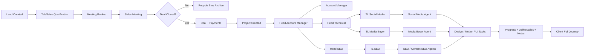

# شرح شامل للأدوار وتدفق البيانات داخل نظام Thamara ERP/CRM

هذه الوثيقة هي المرجع التشغيلي والفني لفهم نظام Thamara ERP/CRM بالكامل. الهدف منها أن تكون واضحة لأي AI أو مطور سيكمل بناء النظام بدون الحاجة لسؤال متكرر عن الرؤية العامة.

تم بناء هذه الوثيقة بناءً على:

- رؤية صلاح لطريقة عمل الشركة.
- ملخص الموديولات المنفذة في TeleSales وSales.
- ملفات Elmotech الخاصة بالمواصفات الفنية والعرض.
- الحالة الحالية للكود، مع عدم اعتبار هذه الوثيقة بديلًا عن فحص الكود قبل التنفيذ.

## 1. الهدف العام للنظام

النظام عبارة عن ERP/CRM لشركة تسويق، وهدفه إدارة دورة حياة العميل والموظف والماليات داخل منصة واحدة.

النظام يغطي:

- دخول العميل كـ Lead.
- تأهيل العميل عن طريق TeleSales.
- حجز الاجتماع وتحويله إلى Sales.
- إغلاق الصفقة وتسجيل بيانات العقد والدفع.
- إنشاء مشروع تلقائي بعد إغلاق الصفقة.
- توزيع المشروع على Account Management وTechnical Teams.
- تنفيذ المهام ومتابعة التقدم.
- إدارة التحذيرات والشكاوى.
- متابعة التحصيل والدفعات.
- حساب التارجت والعمولات والرواتب.
- إدارة الموظفين والحضور والترقيات والتوظيف.
- إعدادات النظام والصلاحيات.

المبادئ الأساسية:

- كل عميل له ملف مركزي واحد يمثل الحقيقة الكاملة عنه.
- كل مشروع مرتبط بصفقة وعميل وفرق تنفيذ ومهام وملاحظات وتحذيرات.
- كل موظف يرى ما يخص دوره فقط، إلا الأدوار القيادية والإدارية المصرح لها.
- أي تغيير مهم يجب أن يترك أثرًا في Logs.
- العملة الرسمية في النظام هي الريال السعودي SAR.
- أدوار TeleSales وSales الحالية لا يتم تعديل منطقها إلا بطلب واضح من صلاح، ويتم البناء فوق مخرجاتها.

## 2. الأدوار الرسمية المعتمدة

يجب اعتماد أسماء الأدوار التالية كما هي في الكود وقاعدة البيانات:

| Role Key | الوصف |
| --- | --- |
| `super_admin` | مدير النظام العام |
| `tele_sales_agent` | موظف تيلي سيلز |
| `tele_sales_manager` | مدير تيلي سيلز |
| `sales_agent` | موظف مبيعات |
| `sales_manager` | مدير مبيعات |
| `chief_sales` | رئيس/Chief Sales |
| `head_account_manager` | Head Account Manager |
| `account_manager` | Account Manager |
| `head_technical` | Head Technical |
| `head_seo` | Head SEO |
| `team_leader_seo` | قائد فريق SEO |
| `agent_seo` | موظف SEO |
| `agent_content_seo` | موظف Content SEO |
| `team_leader_media_buyer` | قائد فريق Media Buying |
| `agent_media_buyer` | موظف Media Buying |
| `team_leader_social_media` | قائد فريق Social Media |
| `agent_social_media` | موظف Social Media |
| `leader_graphic_designer` | قائد Graphic Design |
| `agent_graphic_designer` | موظف Graphic Design |
| `leader_motion_graphic` | قائد Motion Graphic |
| `agent_motion_graphic` | موظف Motion Graphic |
| `leader_ui` | قائد UI/UX |
| `agent_ui` | موظف UI/UX |
| `hr_manager` | مدير HR |
| `accountant` | المحاسب |

ملاحظات مهمة:

- الاسم الصحيح هو `chief_sales` وليس `cheif_sales`.
- الاسم الصحيح هو `designer` وليس `desginer`.
- لو توجد بيانات قديمة بالأسماء الخاطئة، يتم دعم alias مؤقتًا أو migration آمن، وليس تغييرًا عشوائيًا يكسر البيانات.

## 3. الرحلة العامة للعميل



## 4. كيانات البيانات الأساسية

### 4.1 Lead

يمثل العميل قبل إغلاق الصفقة.

البيانات المطلوبة:

- الاسم.
- الهاتف.
- المصدر.
- الجنسية.
- النوع.
- رابط المتجر.
- هل لديه متجر.
- المجال/Niche.
- التصنيف: Hot / Warm / Cold.
- نوع العميل: Store / Launch / Dropshipping / Shipping / Special.
- الحالة: New / Contacted / No Answer / Interested / Transferred / In Sales / Closed Won / Closed Lost / Archived.
- TeleSales Agent.
- Sales Agent.
- تاريخ الإنشاء.
- تاريخ أول تواصل.
- تاريخ الاجتماع.
- الملاحظات.

### 4.2 Call Log

يمثل كل محاولة اتصال من TeleSales.

البيانات المطلوبة:

- العميل.
- الموظف.
- حالة الاتصال: تم الرد / مشغول / رقم خاطئ / تم تحديد موعد.
- تصنيف العميل.
- الملاحظات.
- تاريخ الاجتماع إن وجد.
- وقت التسجيل.

### 4.3 Meeting

يمثل اجتماع Sales مع العميل.

البيانات المطلوبة:

- العميل.
- TeleSales Agent.
- Sales Agent.
- تاريخ ووقت الاجتماع.
- الحالة: Scheduled / Attended / Lost / Won.
- Sales Notes.
- Summary.
- Deal Amount إن وجد.

### 4.4 Deal

يمثل الصفقة بعد الإغلاق.

البيانات المطلوبة:

- Lead ID.
- Sales Agent.
- Package.
- بداية العقد.
- نهاية العقد.
- Total Amount بالريال السعودي SAR.
- First Amount بالريال السعودي SAR.
- Payment Method: Cash / Transfer / Tabby / Tamara.
- Net Target بعد خصم رسوم Tabby/Tamara.
- Installments.
- Contract Image URL.
- Receipt URL.
- Status.

قاعدة مهمة:

- رسوم Tabby/Tamara الافتراضية هي 7%.
- Net Target = Cash/Transfer Amount × 1.0 + Tabby/Tamara Amount × 0.93.

### 4.5 Project

يمثل مرحلة التنفيذ بعد إغلاق الصفقة.

البيانات المطلوبة:

- Deal ID.
- Account Manager.
- Head Technical.
- Head SEO.
- Package.
- Niche.
- Technical Deadline.
- Final Deadline.
- Progress لكل قسم.
- Store Created.
- User Created Store.
- Store URL.
- Drive Link.
- Priority.
- Lifecycle State.
- Project Status.
- Notes.
- Team Assignments.
- Tasks.
- Files.
- Logs.
- Warnings.

قاعدة مهمة:

- لا يجب أن تبقى صفقة مغلقة بدون مشروع، إلا لو هناك حالة business مقصودة ومعلّمة بوضوح.

### 4.6 Task

يمثل مهمة تنفيذية داخل المشروع.

البيانات المطلوبة:

- Project ID.
- Task Type.
- Leader.
- Agent.
- Requester Role.
- Assigned Role.
- Checklist Items.
- Brief.
- Task Link.
- Files / Deliverables.
- Priority.
- Deadline.
- Status: pending / in_progress / review / done.
- Progress Percentage.
- Parent Task عند وجود مهمة فرعية.
- Started At.
- Completed At.
- Flag Reason عند الإرجاع.

### 4.7 Note

يمثل ملاحظة مركزية على المشروع.

البيانات المطلوبة:

- Project ID.
- User ID.
- User Name.
- User Role.
- Category.
- Content.
- Created At.

التصنيفات:

- telesales.
- sales.
- account_manager.
- technical.
- seo.
- social_media.
- media_buyer.
- design.
- motion_graphic.
- ui_design.
- content_seo.
- general.

### 4.8 Warning

يمثل تحذير أو شكوى مؤثرة تخص العميل أو المشروع.

البيانات المطلوبة:

- Client ID أو Lead ID.
- Project ID.
- Subject.
- Message.
- Severity: Low / Medium / High / Critical.
- Status: Active / Resolved / Archived.
- Sender User.
- Sender Role.
- Recipient Users أو Recipient Roles.
- Receipts لكل شخص يجب أن يقرأ التحذير.

## 5. موديول TeleSales

هذا الموديول تم اختباره من صلاح ويعتبر مستقرًا حاليًا. لا يتم تعديل منطق عمله إلا بطلب واضح.

### 5.1 TeleSales Agent

الصلاحيات:

- رؤية الليدز المسندة إليه.
- إضافة Leads عند الحاجة.
- تسجيل المكالمات.
- تعديل حالة العميل.
- تحديد التصنيف Hot/Warm/Cold.
- إضافة ملاحظات إجبارية.
- تحديد موعد الاجتماع عند اختيار حالة "تم تحديد موعد".

Dashboard يجب أن تحتوي على:

- جدول العملاء المسندين.
- فلاتر الحالة والتصنيف والتاريخ.
- Call Logging Popup.
- KPI بسيط عن المكالمات والاجتماعات.
- My Progress.

البيانات التي ينتجها:

- Call Logs.
- Classification.
- Meeting Date.
- Notes.
- Lead Status.

### 5.2 TeleSales Manager

الصلاحيات:

- رؤية أداء كل TeleSales Agents.
- إدارة Targets الخاصة بالاجتماعات.
- مراقبة جودة المكالمات.
- Drill-down على الأرقام.
- إدارة Cold Leads.
- Reassign للعملاء بين موظفي TeleSales.
- Recycle/Redistribute للعملاء المفقودين من TeleSales.

Dashboard يجب أن تحتوي على:

- Aggregated View لكل الفريق.
- Team Analytics.
- Targets.
- Conversion Rates.
- Meetings Booked.
- Attended / Lost.
- Recycle Bin.

## 6. موديول Sales

هذا الموديول تم اختباره من صلاح ويعتبر مستقرًا حاليًا. لا يتم تعديل منطق عمله إلا بطلب واضح.

### 6.1 Auto Assignment من TeleSales إلى Sales

قواعد التوزيع:

- الموظف يجب أن يكون Available.
- مطابقة التخصص مع نوع العميل Hot/Warm/Cold.
- Hot Leads تذهب للأكثر خبرة عند وجود قاعدة مستويات.
- يتم اختيار الأقل تحميلًا من حيث اجتماعات اليوم.

### 6.2 Sales Agent

الصلاحيات:

- استقبال العملاء المحولين له.
- تغيير حالته: Available / Busy / In Call / Break.
- بدء مهمة/اجتماع مع العميل.
- تسجيل Feedback إلزامي عند إنهاء المهمة.
- إغلاق الصفقة.
- إدخال بيانات العقد والدفع.
- إنشاء Warning إذا اشتكى العميل بعد البيع.
- رؤية حالة العميل بعد البيع من Deals/Client Journey.

Deal Closing Form يجب أن يحتوي على:

- Package.
- Contract Start.
- Contract End.
- Total Amount SAR.
- First Payment SAR.
- Payment Method.
- Installments.
- Contract Image.
- Receipt.
- Store status.
- Sales notes.

### 6.3 Sales Manager

الصلاحيات:

- مراقبة فريق Sales.
- رؤية Live Status للموظفين.
- مراجعة الصفقات.
- إدارة Recycle Bin.
- Reassign للعملاء المرفوضين لمحاولة جديدة.
- اعتماد أو متابعة الخصومات إن وجدت.
- رؤية Master Sheet ورحلة العميل الكاملة.
- إنشاء Warning عند الحاجة.

### 6.4 Chief Sales

الصلاحيات:

- رؤية الصورة القيادية الكاملة للمبيعات وTeleSales.
- متابعة Pipeline.
- رؤية Deals Pipeline وProjects Pipeline.
- Drill-down على الإيرادات والاجتماعات والتحويلات.
- رؤية أداء Sales Managers وTeleSales Managers.
- رؤية العميل بعد البيع لمراجعة جودة البيع والتنفيذ.

لا يجب أن يكون Chief Sales منفذًا يوميًا، بل دور رقابي وتحليلي.

## 7. التسليم من Sales إلى Operations

عند إغلاق الصفقة:

- يتم تحديث Lead إلى Closed Won.
- يتم إنشاء Deal.
- يتم إنشاء Installments إن وجدت.
- يتم حساب Net Target.
- يتم إنشاء Project أو فتح خطوة Project Setup بشكل مضمون.
- تظهر الصفقة الجديدة لدى Account Management.
- يتم إرسال إشعار للمدير المباشر أو الإدارة المختصة.

البيانات التي يجب أن تنتقل:

- كل بيانات Lead.
- كل Call Logs.
- كل Meetings.
- Sales Feedback.
- Deal Details.
- Payment Plan.
- Contract Links.
- Package.
- Niche.
- Store Link.
- Customer Requirements.

## 8. موديول Account Management وOperations

### 8.1 Head Account Manager

هو المالك الإداري الأعلى للعملاء بعد البيع.

الصلاحيات:

- رؤية كل المشاريع.
- توزيع المشروع على Account Manager.
- ربط المشروع مع Head Technical.
- ربط المشروع مع Head SEO.
- متابعة Progress لكل مشروع.
- متابعة Warnings.
- تغيير Lifecycle State عند الحاجة.
- رؤية كل الفريق العامل على العميل.

Dashboard يجب أن تحتوي على:

- Projects Pipeline.
- Unassigned Projects.
- Assigned Projects.
- Delayed Projects.
- Active Warnings.
- Team Workload.
- Client Full Journey links.

### 8.2 Account Manager

هو المسؤول اليومي عن العميل.

الصلاحيات:

- رؤية المشاريع المسندة إليه.
- إعداد المشروع بعد الصفقة.
- تحديد Niche.
- تحديد Package.
- تحديد Technical Deadline.
- إضافة Drive Link وStore URL.
- متابعة كل الفرق.
- إضافة Notes.
- إنشاء Warnings.
- تغيير Lifecycle State للمشروع الخاص به.
- طلب أو متابعة المهام.

Dashboard يجب أن تحتوي على:

- قائمة العملاء المسندين.
- حالة كل مشروع.
- الفريق العامل على العميل.
- Progress لكل خدمة.
- Tasks open/done.
- Warnings.
- Client Journey.

### 8.3 Head Technical

الصلاحيات:

- رؤية المشاريع المرتبطة به.
- توزيع المشروع أو المهام على:
  - Team Leader Social Media.
  - Team Leader Media Buyer.
- متابعة تقدم الفرق التابعة له.
- رؤية Notes وWarnings.

لا يوزع مباشرة على Head SEO، لأن مسار SEO منفصل.

### 8.4 Head SEO

الصلاحيات:

- رؤية مشاريع SEO المرتبطة به.
- توزيعها على Team Leader SEO.
- متابعة SEO وContent SEO.
- رؤية Progress وWarnings.

### 8.5 Team Leaders

الأدوار:

- `team_leader_seo`
- `team_leader_media_buyer`
- `team_leader_social_media`
- `leader_graphic_designer`
- `leader_motion_graphic`
- `leader_ui`

الصلاحيات:

- رؤية المشاريع أو المهام المسندة لفريقه.
- توزيع المهام على Agents.
- Reassign داخل الفريق.
- متابعة الجودة.
- مراجعة المخرجات.
- نقل المهمة إلى Review أو Done حسب القاعدة.
- قراءة Client Journey قبل التنفيذ.

### 8.6 Agents

الأدوار:

- `agent_seo`
- `agent_content_seo`
- `agent_media_buyer`
- `agent_social_media`
- `agent_graphic_designer`
- `agent_motion_graphic`
- `agent_ui`

الصلاحيات:

- رؤية المهام المسندة إليه.
- تحديث الحالة: pending / in_progress / review / done.
- تحديث Progress.
- إضافة Notes.
- رفع روابط أو مخرجات.
- Flag/Return للمهمة عند وجود مشكلة.
- رؤية Warnings الخاصة بالعميل.

## 9. قواعد التوزيع بين الأدوار

### 9.1 توزيع المشروع الرئيسي

- Head Account Manager → Account Manager.
- Head Account Manager → Head Technical.
- Head Account Manager → Head SEO.
- Account Manager → Head SEO عند الحاجة.

### 9.2 توزيع الفرق التقنية

- Head Technical → Team Leader Social Media.
- Head Technical → Team Leader Media Buyer.
- Head SEO → Team Leader SEO.
- Team Leader Social Media → Agent Social Media.
- Team Leader Media Buyer → Agent Media Buyer.
- Team Leader SEO → Agent SEO أو Agent Content SEO.
- Leader Graphic Designer → Agent Graphic Designer.
- Leader Motion Graphic → Agent Motion Graphic.
- Leader UI → Agent UI.

### 9.3 Cross-team Tasks

Social Media Agent أو Media Buyer Agent يستطيع إنشاء مهام إلى:

- Graphic Design.
- Motion Graphic.
- UI/UX.

SEO Agent يستطيع إنشاء مهام إلى:

- Content SEO.
- UI/UX.
- Graphic Design عند الحاجة.

القواعد:

- المهمة تذهب أولًا إلى Team Leader المختص.
- Team Leader يوزعها على Agent.
- يتم ربط المهمة بالعميل والمشروع وبالمهمة الأصلية لو كانت Subtask.

## 10. Package Decomposition

عند إعداد المشروع، يجب تفتيت الباقة إلى مهام تلقائيًا.

أمثلة:

### SEO Package

- SEO Setup.
- Keyword Research.
- Technical Audit.
- Content Plan.
- Content SEO Tasks.
- UI/UX Task عند وجود تعديل صفحات.
- Progress field: SEO Progress.

### Social Media Package

- Social Strategy.
- Content Calendar.
- Design Requests.
- Motion Requests عند الحاجة.
- Publishing/Follow-up.
- Progress field: Social Media Progress.

### Media Buying Package

- Campaign Setup.
- Pixel/Tracking Check.
- Creative Requests.
- Landing Page/UI Request عند الحاجة.
- Campaign Monitoring.
- Progress field: Media Buyer Progress.

### Full Package

يتم إنشاء كل مسارات SEO + Social Media + Media Buying، مع إمكانية إنشاء مهام Design/Motion/UI تلقائيًا أو يدويًا حسب الطلب.

## 11. Progress Tracking

قواعد التقدم:

- Agent يحدث Progress داخل المهمة.
- Team Leader يرى متوسط تقدم مهام فريقه لنفس المشروع.
- Project Progress لكل قسم يتحدث من متوسط مهام القسم.
- Account Manager يرى Progress النهائي لكل خدمة.
- Head Account Manager يرى Progress المجمع لكل المشاريع.

قواعد الحالة:

- pending: لم يبدأ العمل.
- in_progress: بدأ العمل فعليًا.
- review: العمل جاهز للمراجعة.
- done: تم الاعتماد أو الانتهاء.

Store Flags:

- لو Agent أنهى مهمة إنشاء متجر، يتم تحديث `storeCreated`.
- لو المستخدم/العميل أنشأ المتجر، يتم تحديث `userCreatedStore`.
- تظهر هذه القيم في Project وClient Journey.

## 12. Client Full Journey

كل شخص له علاقة بالعميل يجب أن يقدر يفتح صفحة رحلة العميل حسب صلاحياته.

المحتوى المطلوب:

- Lead Created.
- TeleSales Call Logs.
- Meeting Booked.
- Sales Meeting.
- Sales Notes.
- Deal Closed.
- Payment Plan.
- Installments.
- Project Created.
- Account Manager Assignment.
- Head Technical / Head SEO Assignment.
- Team Assignments.
- Tasks.
- Subtasks.
- Progress.
- Notes.
- Files.
- Warnings.
- System Logs.

الغرض:

- أي موظف جديد يفهم العميل فورًا.
- Account Manager يعرف المشروع واقف فين.
- Sales يعرف ما حدث بعد البيع.
- الإدارة تربط جودة البيع بجودة التنفيذ.

## 13. Warnings System

يستخدم عند شكوى العميل أو ظهور مشكلة مؤثرة.

من يستطيع إنشاء Warning:

- Account Manager.
- Sales Agent.
- Sales Manager.
- Head Account Manager.
- Super Admin.

من يظهر له التحذير:

- Account Manager المسؤول.
- Head Account Manager.
- Head Technical إذا كان ضمن المشروع.
- Head SEO إذا كان ضمن المشروع.
- كل Team Leader ضمن المشروع.
- كل Agent ضمن المشروع.
- Sales Agent عند الحاجة لأنه كان نقطة اتصال مع العميل.

السلوك:

- يظهر Popup إجباري.
- لا يستطيع المستخدم تجاهله.
- يجب الضغط على "تم قراءة التحذير".
- يتم تسجيل Warning Receipt باسم المستخدم ووقت القراءة.
- لا يظهر لنفس المستخدم بعد القراءة.
- يبقى موجودًا في سجل العميل.
- منشئ التحذير فقط أو Super Admin يستطيع Resolve حسب سياسة النظام.

## 14. Finance Module

### 14.1 Accountant

الصلاحيات:

- رؤية كل الصفقات والدفعات.
- متابعة Installments.
- تعليم الدفعة كمدفوعة.
- رؤية إجمالي الإيرادات.
- رؤية المحصل والمتبقي.
- حساب العمولات.
- مراجعة الرواتب والخصومات.
- Finalize Payout.
- Export للبيانات المالية.

Dashboard يجب أن تحتوي على:

- Total Revenue.
- Total Collected.
- Total Remaining.
- Upcoming Installments.
- Overdue Installments.
- Commissions Table.
- Payroll/Net Payout.
- Export XLSX.

### 14.2 Net Target Formula

القواعد:

- Cash وTransfer يحتسبان بنسبة 100%.
- Tabby وTamara يتم خصم رسوم البوابة.
- الرسوم الافتراضية 7%.

المعادلة:

```text
Net Target = Cash Amount + Transfer Amount + (Tabby/Tamara Amount * (1 - gateway_fee_pct))
```

### 14.3 Commission Tiers

القيم الافتراضية:

| Net Target SAR | Commission |
| --- | --- |
| 1,000 - 15,000 | 1.5% |
| 15,001 - 20,000 | 2.0% |
| 20,001+ | 2.5% |

يجب أن تكون هذه الشرائح قابلة للتعديل من System Config.

### 14.4 TeleSales Bonuses

يجب دعم:

- Bonus عند تحقيق 100% من meetings target.
- Bonus عند 125%.
- Bonus عند 150%.
- نسبة أو bonus إضافي على العملاء الذين تحولوا وأغلقوا Deals.

### 14.5 Payroll

البيانات المطلوبة:

- Base Salary.
- Monthly Target.
- Commission Amount.
- Bonuses.
- Deductions.
- Net Payout.
- Finalized.

يجب عدم تعديل payout finalized إلا بصلاحية خاصة أو audit log واضح.

## 15. HR Module

### 15.1 HR Manager

الصلاحيات:

- إدارة الموظفين.
- إنشاء موظف جديد.
- تعديل بيانات الموظف.
- تفعيل/تعطيل الحساب.
- إدارة الحضور والانصراف.
- إدارة التوظيف.
- إدارة الترقيات.
- إدارة مستندات الموظفين.
- مراجعة الخصومات.
- متابعة warning/termination flags.

### 15.2 User Management

Create Employee يجب أن يحتوي على:

- الاسم.
- البريد.
- الهاتف.
- كلمة مرور أولية.
- Role.
- Level: Junior / Mid / Senior.
- Direct Manager.
- Company عند وجود أكثر من شركة.
- Base Salary.
- Monthly Target.
- Status: Active / Inactive.

### 15.3 Attendance

القواعد:

- Check In.
- Check Out.
- Late Minutes.
- Deduction Draft.
- HR approval للخصم.
- إمكانية الربط مستقبلًا بجهاز بصمة.

### 15.4 Hiring Pipeline

المراحل:

- New/Application Received.
- HR Interview.
- Sales Manager Interview أو Team Leader Interview حسب الدور.
- Offer.
- Rejected.
- Hired.
- Hold للمرشحين المرفوضين القابلين للرجوع لهم.

### 15.5 Promotion Engine

القواعد:

- Junior → Mid عند تحقيق 60% من التارجت لمدة 3 أشهر متتالية.
- Mid → Senior عند تحقيق 80%-90% من التارجت لمدة 3 أشهر متتالية.
- Senior → Team Leader عند ثبات الأداء والجاهزية القيادية لمدة 3 أشهر.
- 50%-70% بشكل متكرر: Warning.
- أقل من 50% لشهرين متتاليين: Termination Flag.

كل recommendation يجب أن تكون قابلة للمراجعة من HR، ولا يتم التفعيل النهائي بدون action واضح.

### 15.6 Employee Documents

يجب دعم:

- CV.
- Contract.
- ID.
- Certificates.
- Other documents.

مع رابط الملف، اسم المستند، الموظف، وتاريخ الرفع.

## 16. My Profile Page

كل موظف يجب أن يكون له Profile.

المحتوى:

- البيانات الشخصية.
- الدور.
- المستوى.
- المدير المباشر.
- الحالة.
- Attendance summary.
- Performance progress.
- Monthly target.
- Achievement percentage.
- Promotion path.
- آخر 3 أشهر أداء.
- Base salary.
- Live commission.
- Bonuses.
- Deductions.
- Net payout عند توفره.
- Administrative tasks.
- Documents الخاصة به عند السماح.

Sales وTeleSales يجب أن يروا KPIs الخاصة بهم، والفرق التنفيذية ترى مهامها وتقدمها.

## 17. Super Admin وSystem Configuration

### 17.1 Super Admin

الصلاحيات:

- Full access.
- إدارة المستخدمين.
- إدارة الأدوار.
- إدارة الصلاحيات.
- إدارة System Config.
- إدارة Commission Tiers.
- إدارة Gateway Fee.
- إدارة Salary Ranges.
- إدارة Deduction Rules.
- إدارة Package Templates.
- رؤية كل التقارير.
- Export.

### 17.2 System Config

يجب أن يدعم:

- `gateway_fee_pct`.
- `commission_tiers`.
- TeleSales bonus rules.
- Salary ranges.
- Deduction rules.
- Package templates.
- Team leader dynamic targets.
- Role permissions.

### 17.3 Permissions Management

المطلوب النهائي:

- View.
- Create.
- Edit.
- Delete.
- Export.

لكل role ولكل resource.

ملاحظة:

- لو الشاشة الحالية تعرض Permission Matrix فقط، فهذا لا يكفي كموديول Permissions كامل. المطلوب أن تكون الصلاحيات قابلة للإدارة أو تكون ثابتة بالكود مع توثيق واضح حسب قرار صلاح.

## 18. Notifications

يجب إرسال Notifications عند:

- Lead assigned.
- Meeting booked.
- Deal closed.
- Project created.
- Project assigned.
- Task assigned.
- Task moved to review.
- Task completed.
- Warning created.
- Warning acknowledged.
- Installment due soon.
- Payment overdue.
- Promotion recommendation.
- HR warning/termination flag.

كل Notification يجب أن تحتوي على:

- User ID.
- Title.
- Message.
- Type.
- Link.
- Related ID.
- Read status.
- Created At.

## 19. Recycle Bin وArchive

### 19.1 TeleSales Recycle

لعملاء فشل التواصل معهم أو يحتاجون محاولة أخرى.

### 19.2 Sales Recycle

للعملاء الذين انتهت محاولة إغلاقهم بـ False/Lost.

الصلاحيات:

- Sales Manager يستطيع Reassign.
- Sales Manager يستطيع Archive.
- يجب حفظ سبب الفشل.
- لا يتم حذف العميل نهائيًا إلا بسياسة واضحة.

## 20. Master Sheet / Global Reports

الغرض:

- رؤية رحلة العميل كاملة من أول TeleSales حتى التحصيل والتنفيذ.

المحتوى:

- Lead info.
- TeleSales agent.
- TeleSales notes.
- Meeting date.
- Sales agent.
- Sales notes.
- Deal amount.
- Payment method.
- Net target.
- Account Manager.
- Teams assigned.
- Project progress.
- Installments.
- Warnings.
- Lifecycle state.

الأدوار التي ترى هذه الشاشة:

- Super Admin.
- Chief Sales.
- Sales Manager حسب الصلاحية.
- Head Account Manager حسب الصلاحية.
- Accountant للجزء المالي.

## 21. قواعد الوصول للبيانات

القواعد العامة:

- Super Admin يرى كل شيء.
- Chief Sales يرى مبيعات وPipeline وما بعد البيع بصورة رقابية.
- Head Account Manager يرى كل مشاريع Operations.
- Account Manager يرى مشاريعه فقط.
- Head Technical يرى المشاريع المرتبطة به.
- Head SEO يرى مشاريع SEO المرتبطة به.
- Team Leader يرى مهام فريقه ومشاريعه.
- Agent يرى مهامه فقط.
- Sales Agent يرى العملاء والصفقات الخاصة به، ويستطيع رؤية ما بعد البيع للعميل الذي أغلقه.
- Sales Manager يرى فريقه.
- TeleSales Manager يرى فريقه.
- Accountant يرى الماليات.
- HR Manager يرى الموظفين والحضور والتوظيف والترقيات.

## 22. قواعد التنفيذ الفنية للـ AI

عند تنفيذ أي تغيير:

- افحص الكود الحالي أولًا.
- لا تكسر TeleSales وSales الحاليين.
- لا تغير أسماء الأدوار بدون migration واضح.
- استخدم `Project` ككيان مركزي بعد البيع.
- اربط Tasks وNotes وWarnings بالمشروع.
- لا تجعل Warning يعتمد على roles فقط إذا كان يمكن تحديد users فعليين من TeamAssignment.
- أي Assignment يجب أن يضيف TeamAssignment أو يحدث الحقول المناسبة.
- أي تغيير في status أو assignment أو warning أو payment يجب أن يسجل ProjectLog أو Log مناسب.
- أي مبلغ مالي يجب عرضه بـ SAR.
- Default Tabby/Tamara fee يجب أن يكون 7% في كل مكان.
- يجب أن تكون العمليات المالية الحساسة audit-friendly.
- يفضل أن يكون Deal Close + Project Create flow مضمونًا وغير قابل لفقدان المشروع.

## 23. أهم الفجوات التي يجب إغلاقها

هذه ليست قائمة تنفيذ نهائية، لكنها أهم نقاط يجب التأكد منها قبل البناء الكبير:

- توحيد fallback رسوم Tabby/Tamara إلى 7% في كل الكود.
- التأكد أن إغلاق الصفقة ينشئ Project أو يضمن setup بدون فقدان.
- تحويل Permission Matrix من عرض فقط إلى صلاحيات قابلة للإدارة إذا كان هذا مطلوبًا.
- إضافة بيانات Level / Direct Manager / Salary / Monthly Target عند إنشاء الموظف.
- توثيق أو بناء Package Templates التي تنتج Tasks تلقائيًا.
- التأكد أن Progress يتحدث من Task إلى Project بشكل صحيح.
- دعم TeleSales bonuses بشكل واضح.
- استكمال My Profile ليعرض الأداء والترقية والماليات والمهام.
- ضبط Warning recipients بناءً على المستخدمين الفعليين العاملين على العميل.
- دعم aliases أو migration لأسماء roles الخاطئة إن وجدت.
